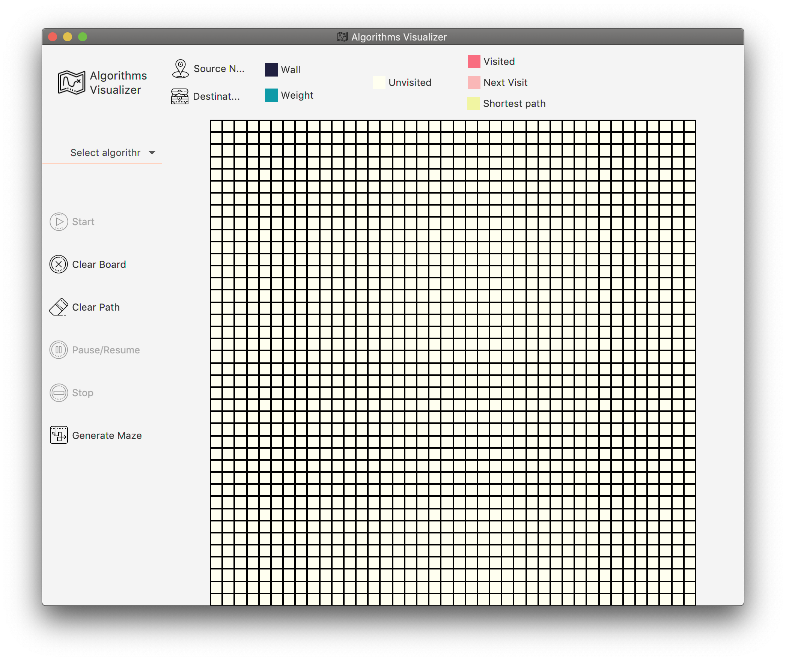

# Algorithm Visualizer
> Welcome to ALgorithm Visualizer. In this project, we focus on pathfinding algorithms and visualize them in action. Enjoy!

## Table of contents
* [General info](#general-info)
* [Screenshots](#screenshots)
* [Setup](#setup)
* [Basic Controls](#basiccontrols)
* [Features](#features)
* [Status](#status)
* [Inspiration](#inspiration)

## General info

This project is designed and implemented in Java as a product of Object-Oriented Programming course. \Some OOP principles: SOLID - Single Responsibility Principle, Open Close Principle, Livskov Substitution Principle, Interface Segragation Principle,Dependency Inversion Principle are elaborately considered on the design of the project.

## Screenshots

## Requirements
* Java SDK 14 
* JavaFX 15
* ScenceBuilder
* Controlsfx, jfoenix
* IntelliJ IDEA CE

## Setup
To run this project, you just need to install and add the required libraries to project.\
Change VM options:\
Run / Edit configurations / VM options:
--module-path path-to-your-javafx-library --add-modules javafx.controls,javafx.fxml,javafx.base

## Basic Controls
You need to create a source and destination to start the pathfinding.

### Algorithms
Our project supports 3 searching algorithms:
* Breadth first search (unweighted)
* Depth first search (unweighted)
* Dijkstra (weighted)

### Complicated Stuff
Those are the basics! Now you can be free to make the map as complicated as you desire. You can easily add weighted cells and walls.

### Maze
One more interesting point is that you can create maze and challenge the algorithms for find a path to reach the destination.

## Status
Project is: _in progress_. \We will develop this application with some more awesome functions in the near future.

## Inspiration
Project inspired by Clément Mihailescu\
Link github: https://github.com/clementmihailescu/Pathfinding-Visualizer